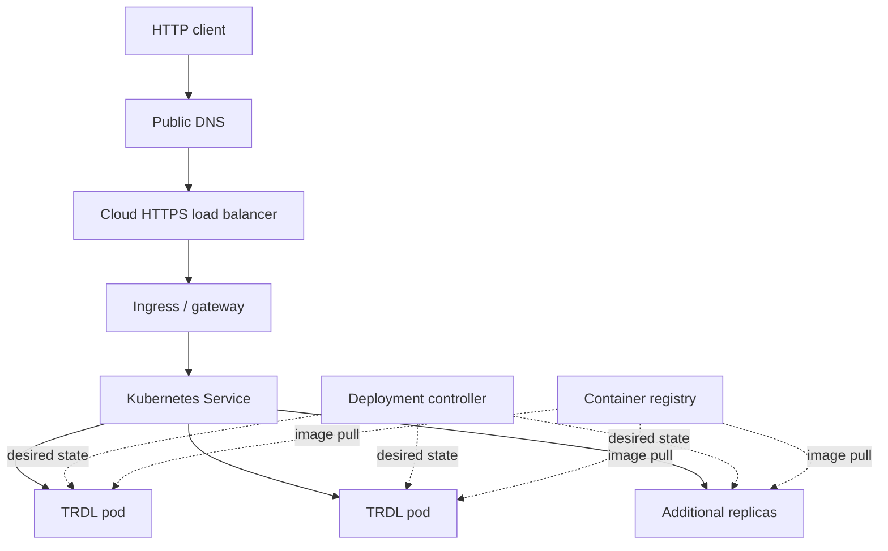
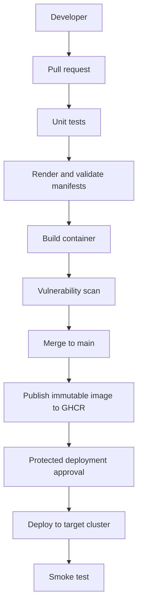

# Architecture

## Target production flow

```mermaid
flowchart TB
    C[HTTP client] --> DNS[Public DNS]
    DNS --> LB[Cloud HTTPS load balancer]
    LB --> IN[Ingress / gateway]
    IN --> SVC[Kubernetes Service]
    SVC --> P1[TRDL pod]
    SVC --> P2[TRDL pod]
    SVC --> PN[Additional replicas]
    D[Deployment controller] -. desired state .-> P1
    D -. desired state .-> P2
    D -. desired state .-> PN
    REG[Container registry] -. image pull .-> P1
    REG -. image pull .-> P2
    REG -. image pull .-> PN
```

## CI flow

```mermaid
flowchart TD
    DEV[Developer] --> PR[Pull request]
    PR --> TEST[Unit tests]
    TEST --> MAN[Render and validate manifests]
    MAN --> BUILD[Build container]
    BUILD --> SCAN[Vulnerability scan]
    SCAN --> MERGE[Merge to main]
    MERGE --> PUSH[Publish immutable image to GHCR]
    PUSH --> APPROVAL[Protected deployment approval]
    APPROVAL --> DEPLOY[Deploy to target cluster]
    DEPLOY --> SMOKE[Smoke test]
```

The protected deployment and cloud deployment steps are the intended next stage; they are not implemented in the sample workflow.
